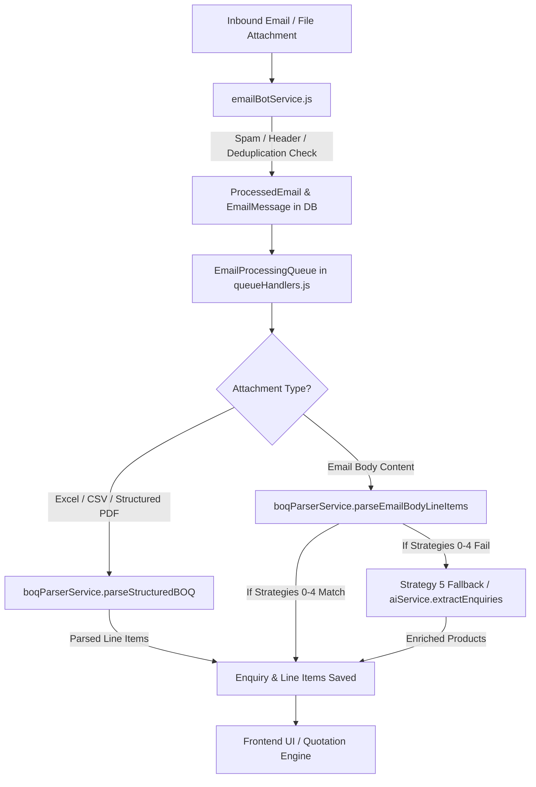

# Comprehensive System Audit: Rules, Parsers, Regexes, Fallbacks & Limitations

This document provides a transparent, complete reference of every parser strategy, regular expression, engineering dictionary, fallback rule, and hardcoded limitation across the **Petro Valve Workflow Automation Engine**.

---

## 1. End-to-End Architecture Overview



---

## 2. Inbound Email Ingestion & Spam Rules (`emailBotService.js`)

### A. Spam & Auto-Response Filter
Emails are immediately dropped without creating enquiries if any of these match:
1. **Self-Sender Check**: `senderEmail === IMAP_USER` or `SMTP_USER` (`ai@petrovalves.co.in`).
2. **Blacklist Sender Patterns**:
   - `noreply`, `no-reply`, `donotreply`, `no_reply`
   - `mailer-daemon`, `mailer_daemon`, `postmaster`, `mail-daemon`
   - `newsletter`, `alert`, `notification`, `bounce`, `autoresponse`
3. **Auto-Submitted Header**: Header `Auto-Submitted` exists and is not `'no'`.

### B. Thread & Enquiry Matching Hierarchy
When a new email arrives:
1. **Priority 1 (Explicit Ref ID)**: Regex `ENQ-\d{4}-\d{2}-\d{4}` in Subject or Body. Matches directly to that existing Enquiry.
2. **Priority 2 (Email Thread Headers)**: Matches `In-Reply-To` or `References` header to existing `EmailMessage.threadId` (only for `RE:` emails, never for `FW:` forwards).
3. **Priority 3 (Single Active Enquiry Fallback)**: If customer has exactly 1 active Enquiry in `['New', 'Confirmed', 'Contacted', 'Technical Review', 'Needs Review', 'Verified']` and email is `RE:`.

---

## 3. Structured File BOQ Parsers (`boqParserService.js`)

### A. Excel / CSV Column Header Alias Dictionary
When scanning an Excel sheet (first 35 rows), the parser detects column positions by matching cell text against these alias sets:

| Target Field | Matched Header Tokens (Case-Insensitive) |
| :--- | :--- |
| **Item Number** (`itemNo`) | `sl`, `item no`, `item wise`, `item`, `sr`, `#` |
| **Description** (`desc`) | `description`, `particular`, `particulars`, `item desc`, `specification` |
| **Item Code** (`itemCode`) | `code`, `make`, `item code` |
| **Quantity** (`qty`) | `quantity`, `qty` |
| **Unit** (`unit`) | `unit`, `uom`, `units` |
| **Destination / Site** (`destination`) | `destination`, `delivery site`, `location` |

### B. Geographical Area (GA) Delivery Breakdown Parser (`extractGaDistributionFromText`)
For multi-site tender BOQs (e.g. city gas distribution projects):
- **Header Detection**: Looks for lines with 3+ capitalized city names (e.g. `Pune`, `Nashik`, `Sindhudurg`, `Ramanagara`, `Nanded`, `Nizamabad`, `Mumbai`, `Delhi`, `Ahmedabad`, etc.).
- **Row Mapping**: Aligns item quantity numbers to active city columns, filtering out zeros (`0`, `-`, `–`, `—`).
- **Formatter**: Converts `['Pune']` → `"Pune GA"`, `['Nashik', 'Nizamabad']` → `"Nashik & Nizamabad GAs"`.

### C. Unit Normalization Dictionary (`normalizeUnit`)
Raw unit strings are mapped to standard ERP units:
- `'NOS'`: `nos`, `numbers`, `no`, `number`, `each`, `ea`, `pc`, `pcs`, `pieces`, `uom`, `number(s)`
- `'SET'`: `set`, `sets`
- `'MT'`: `mt`, `metric tons`, `metric ton`, `ton`, `tons`
- `'KG'`: `kg`, `kilograms`, `kilogram`, `kgs`
- `'M'`: `m`, `meter`, `meters`, `mtrs`, `mtr`
- `'M2'`: `m2`, `sqm`, `square meters`, `square meter`, `sq.m`, `sq m`
- `'Mandays'`: `mandays`, `manday`, `man-days`, `man-day`, `man days`, `mondays` *(Preserved strictly for engineering supervision)*
- `'LS'`: `ls`, `lump sum`, `lumpsum`, `l/s`
- `'LOT'`: `lot`, `lots`
- `'Job'`: `job`, `jobs`

### D. Category & Standard Code Detection
- **Categories**:
  - `Supervision`: `\b(supervision|erection|installation|commissioning|consulting|manpower)\b`
  - `Structural`: `\b(ms\s*st|structural|structure|beam|column|plate|angle|channel|grating|chequered|truss|purlin)\b`
  - `Valves`: contains `'valve'`, or `\b(ball|gate|globe|check|butterfly|plug|control|nrv|vlv|chk|btfv|bfv)\b`, or standard codes (`api 6d`, `api 600`, `api 602`, `bs 1868`, etc.)
  - `Storage Tank`: contains `'tank'` or `'vessel'`
  - `Heat Exchanger`: contains `'exchanger'`, `'heater'`, or `'cooler'`
  - `Piping`: contains `'piping'`, `'pipe'`, `'flange'`, `'fitting'`
- **Standards**:
  - `ASME`, `API`, `IBR`, `IS`, `BS`, `EN`
  - Pipe Schedules: `\bsch(?:edule)?[\s\-]*(\d+|std|xs|xxs)\b` → formatted as `Sch 40`, `Sch STD`, `Sch XS`, `Sch XXS`.

---

## 4. Email Body Line Item Parser Strategies (`parseEmailBodyLineItems`)

When an email arrives with text/tabular requirements, it runs through 6 prioritized strategies:

### Pre-Processing: `stripNonValveSections` & `isNonProductRow`
1. **Stripping Non-Valve Sections**: Truncates text at boundaries like `Product Details: Lube Oil`, `Terms and Conditions`, `Payment Terms`, `Regards`, `Thanks and regards` (unless actual valve keywords appear after).
2. **Filtering Prose Sentences**: Rejects intro phrases like `"Supply and delivery of"`, `"Vendor shall"`, `"Please provide quotation"`, `"Dear Sir/Madam"`, `"We are looking for"` **unless** the line contains size/class/valve tokens.

---

### Strategy 0: Multi-Line Specification Blocks
- **Target Format**: Formatted engineering RFQs with bulleted specs:
  ```text
  Item 01: API 6D Floating Ball Valve
  - Size: 2" (50 MM)
  - Pressure Class: 150#
  - Body MOC: ASTM A216 Gr. WCB
  - Quantity: 5 Nos.
  ```
- **Regex**: `/(?:^|\n)\s*(?:item|sr\.?\s*no\.?|sl\.?\s*no\.?|line)\s*[\d]{1,3}\s*[:.)-]\s*(.+?)(?=(?:\n\s*(?:item|sr\.?\s*no\.?|sl\.?\s*no\.?|line)\s*[\d]{1,3}\s*[:.)-]|\n\s*[-–=]{8,}|\n\s*(?:commercial|terms|notes?|thank|regards))|$)/gis`
- **Quantity Regex**: `/(?:qty|quantity|numbers?|pcs|sets?|ea|each)\s*[:=–-]?\s*(\d+)/i` or `/\b(\d+)\s*(?:nos|pcs|sets?|ea|each)\b/i`

---

### Strategy 1: Single-Line Formats (Numbered / Bulleted with Trailing Quantity)
- **Target Format**:
  - `1. 4" Ball Valve Class 150# Nos. 16`
  - `1. 4" Ball Valve Class 150# - 16 Nos.`
  - `1. 4" Ball Valve Class 150# (Qty: 16)`
- **Regex Patterns**:
  - **Pattern A**: `^\s*(?:(?:item|sr|sl|line)?\s*[\d]{1,3}\s*[:.)-]?|[-*•])\s*(.+?)\s+(?:nos|qty|quantity|numbers?|pcs|sets?|ea|each)[.:\s=-]*(\d+)\s*$`
  - **Pattern B**: `^\s*(?:(?:item|sr|sl|line)?\s*[\d]{1,3}\s*[:.)-]?|[-*•])\s*(.+?)\s+[-–:,]?\s*(\d+)\s*(?:nos|qty|quantity|numbers?|pcs|sets?|ea|each)[.:]?\s*$`
  - **Pattern C**: `^\s*(?:(?:item|sr|sl|line)?\s*[\d]{1,3}\s*[:.)-]?|[-*•])\s*(.+?)\s+[-–:,]?\s*\(?\s*(?:qty|quantity)\s*[:=–-]?\s*(\d+)\s*(?:nos|pcs|ea|sets?)?\s*\)?\s*$`
  - **Pattern D**: `^\s*(?:(?:item|sr|sl|line)?\s*[\d]{1,3}\s*[:.)-]?|[-*•])\s*(.+?)\s+[-–:,]?\s*\(\s*(\d+)\s*(?:nos|pcs|ea|sets?|qty|quantity)[.:]?\s*\)\s*$`

---

### Strategy 2: Multi-Line Sequence (Separate Lines for Serial, Desc, Unit, Qty)
- **Target Format**:
  ```text
  1
  4" Shut off valve - pneumatic type
  Nos.
  16
  ```
- **Sequence Parser**:
  1. Detects standalone serial number line: `/^\d{1,3}$/`
  2. Accumulates description lines until encountering unit `/^(?:nos|qty|numbers?|pcs|sets?|ea|lot)[.:]?$/i` or quantity number `/^\d+(?:\.\d+)?$/`
  3. Increments to next serial number (`serialNum + 1`).

---

### Strategy 3: BOQ Table Rows without Serial Numbers (Trailing Quantity)
- **Target Format**:
  - `BALL API6D HOV F/F A/G TRU BOL 2IN 300#    35    EA`
  - `VLV,CHK,A216 WCB,A216 WCB,FLG,300,10IN      1    EA`
- **Regex Patterns**:
  - **Pattern A**: `^(.+?)\s+(\d+)\s+(nos|ea|each|pcs|sets?|mt|kg|lot)\s*$`
  - **Pattern B**: `^(.+?)\s+(nos|ea|each|pcs|sets?|mt|kg|lot)\s+(\d+)\s*$`
  - **Pattern C**: `^(.+?)\s{2,}(\d+)\s*$`

---

### Strategy 4: Tab / Pipe Delimited OCR Table Rows
- **Target Format**:
  - `1 | BALL API6D HOV 2IN 300# | 35 | EA`
- **Logic**: Splits on `/[|\t]/`. Matches rows with 2+ cells containing a numeric cell for quantity and a text cell for description.

---

### Strategy 5: Direct Single-Item Valve RFQ (Deterministic Regex Fallback)
- **Target Format**: Unstructured single-paragraph RFQs like:
  - `"Please quote 2 Nos Ball Valves, 50 mm, Class 150#, Body MOC ASTM A216 WCB. End connection: Flanged RF."`
- **Logic**: Runs `ExtractorRegistry.runAll(tokenizedText)`. If `ValveExtractor` matches and any of `SizeExtractor`, `ClassExtractor`, or `QuantityExtractor` match, extracts 1 item.
- **KNOWN LIMITATION / BUG IDENTIFIED**:
  - If an email has a 12-row table where the quantity is in the **middle column** (e.g. `1.01 Carbon Steel Ball Valve 2" 600# 12 ASTM A216 WCB...`), Strategies 0–4 fail because none of their regexes handle mid-row quantities ending with `API 6D`.
  - The parser then fell through to Strategy 5, which tokenized the whole email, found "Ball Valve", and took line 1 (`"Dear Sir/Madam,"`) as the product description with `qty = null`.

---

## 5. Deterministic Engineering Extractors (`backend/src/services/extraction/`)

### A. ValveExtractor (`ValveExtractor.js`)
- **Compound Types**:
  - `floating ball valve`, `trunnion mounted ball valve`, `knife gate valve`, `wedge gate valve`, `swing check valve`, `lift check valve`, `dual plate check valve`, `non return valve` (NRV), `pressure relief valve` (PRV), `safety relief valve` (SRV)
- **Standard Types**: `ball valve`, `gate valve`, `globe valve`, `check valve`, `butterfly valve`, `plug valve`, `control valve`, `needle valve`, `bfv`
- **Action Verb Guard**: Rejects phrases like `"check the following"`, `"check attached"`, `"check datasheet"` so they are not misidentified as Check Valves.

### B. QuantityExtractor (`QuantityExtractor.js`)
- **Prefix Pattern**: `\b(?:qty|quantity|quantities)\s*[:=\-]?\s*([0-9]+)\b`
  - Negative Lookahead Guard: Cannot be followed by `#`, `psi`, `bar`, `class`, `inch`, `mm`, `dn`, `°C`, `kg`, `lbs`.
- **Suffix Pattern**: `\b([0-9]+)\s*(?:nos\.?|numbers?|sets?|ea\.?|pcs\.?|pieces?)\b`
  - Preceding Context Guard: Rejects numbers preceded by `Class`, `Size`, `DN`, `NPS`, `API`, `DWG`, `Tag`, `Item`.

### C. SizeExtractor (`SizeExtractor.js`)
- **Patterns**:
  - `\b(?:valve\s*size|size|nps|dn)\s*[:=]?\s*([0-9\/\. -]+(?:"|inch|inches|nb|in|mm)?)`
  - `\b(dn\s*[0-9]+)\b`
  - `\b(nps\s*[0-9]+(?:\/[0-9]+)?)\b`
  - `\b([0-9]+(?:\/[0-9]+)?(?:\.[0-9]+)?\s*(?:"|inch|in|nb|mm))\b`
  - Fractions: `1/2"`, `3/4"`, `1-1/2"`, `2-1/2"`
- **Inch to MM NB Conversion**:
  `1/2" → 15mm`, `3/4" → 20mm`, `1" → 25mm`, `1-1/2" → 40mm`, `2" → 50mm`, `3" → 80mm`, `4" → 100mm`, `6" → 150mm`, `8" → 200mm`, `10" → 250mm`, `12" → 300mm`, `14" → 350mm`, `16" → 400mm`, `18" → 450mm`, `20" → 500mm`, `24" → 600mm`.
- **Non-Valve Equipment Guard**: Skips sizes belonging to gaskets, flanges, pipes, or bolts (`"Flange: 4 inch"`).

### D. ClassExtractor (`ClassExtractor.js`)
- **Patterns**:
  - `\b(?:pressure\s*class|class|rating|cl)\s*[:=]?\s*([0-9]+#?)\b`
  - `\b(150|300|400|600|800|900|1500|2500)#\b`
  - `\b([0-9]+)\s*(?:lbs|lb)\b`
- **Context Guard**: Rejects numbers preceded by `temp`, `temperature`, `weight`, `qty`, `drawing`, `dwg`.

### E. NegationDetector (`NegationDetector.js`)
Prevents negated terms from being extracted:
- Matches phrases like: `"not required"`, `"not permitted"`, `"without"`, `"excluding"`, `"except"`, `"do not quote"`.

---

## 6. AI Extraction Pipeline (`aiService.js`)

If all deterministic parsers produce 0 items, the email text and unparsed PDF attachments are sent to AI:

### AI Provider Fallback Cascade
1. **OpenAI** (`gpt-4o-mini`, temperature `0.0`, response_format `json_object`)
2. **Google Gemini** (`gemini-2.0-flash`)
3. **Groq** (`llama-3.3-70b-versatile`)
4. **Timeout**: 30,000ms per attempt with 1 automatic retry on malformed JSON.

### Batch Limitations
- `MAX_PRODUCTS_PER_BATCH`: 50 items per enquiry.
- 100% row preservation: All line items extracted from BOQ tables or emails are kept distinct; no collapsing or merging of same-spec items.

---

## 7. Summary: Current System Limitations & The Solution

| Scenario | Current Behavior | Why It Happens | Resolution |
| :--- | :--- | :--- | :--- |
| **Email with HTML `<table>`** | Extracts 1 fake item (`"Dear Sir/Madam,"`) | Parser only received `bodyText`; regexes expected quantity at line end | Add `parseHtmlTableLineItems` to parse `<table>` cells directly into rows |
| **Plain Text Table with Mid-Column Qty** | Drops through to Strategy 5 | Regexes expect `16 NOS` at end, but row ends with `API 6D` | Add mid-column tabular regex matching `Item Description Size Class Qty Rest...` |
| **Greeting Salutation in Single-Item RFQ** | Takes `"Dear Sir/Madam,"` as description | Strategy 5 took line 1 of stripped text when no item pattern matched | Add salutation / prose guard in Strategy 5 |

---
*Audit Document Generated for Petro Valve Workflow Automation System*
